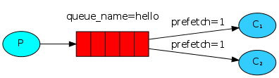

#Work Queues 

工作队列（即任务队列）的主要思想是不用一直等待资源密集型的任务处理完成，这就像一个生产线，将半成品放到生产线中，然后在生产线后面安排多个工人同时对半成品进行处理，这样比一个生产线对应一个工人的吞吐量大几个数量级。

这次我们模拟一个工厂流水线的场景，由工厂任务安排者（生产者P）向流水线（RabbitMQ的队列hello）放入半成品，然后由多个工人（消费者C1和C2）从流水线获取半成品进行处理。 

##消息轮询分发
1、启动工人（消费者）
```
Worker1 [*] Waiting for messages. To exit press CTRL+C
Worker2 [*] Waiting for messages. To exit press CTRL+C
```
2、启动工厂任务安排者（生产者）  
生产者启动后打印的日志：
```
 [x] Sent 'Hello World! 0'
 [x] Sent 'Hello World! 1'
 [x] Sent 'Hello World! 2'
 [x] Sent 'Hello World! 3'
 [x] Sent 'Hello World! 4'
```
Worker1日志输入结果：

```
Worker1 [*] Waiting for messages. To exit press CTRL+C
Worker1 [x] Received 'Hello World! 1'
Worker1 [x] Done
Worker1 [x] Received 'Hello World! 3'
Worker1 [x] Done
```
Worker2日志输入结果：
```
Worker2 [*] Waiting for messages. To exit press CTRL+C
Worker2 [x] Received 'Hello World! 0'
Worker2 [x] Done
Worker2 [x] Received 'Hello World! 2'
Worker2 [x] Done
Worker2 [x] Received 'Hello World! 4'
Worker2 [x] Done
```
##消息确认
    
    如果处理一条消息需要几秒钟的时间，你可能会想，如果在处理消息的过程中，消费者服务器、网络、网卡出现故障挂了，那可能这条正在处理的消息或者任务就没有完成，就会失去这个消息和任务。 
    为了确保消息或者任务不会丢失，RabbitMQ支持消息确认–ACK。
    ACK机制是消费者端从RabbitMQ收到消息并处理完成后，反馈给RabbitMQ，RabbitMQ收到反馈后才将此消息从队列中删除。
    如果一个消费者在处理消息时挂掉（网络不稳定、服务器异常、网站故障等原因导致频道、连接关闭或者TCP连接丢失等），那么他就不会有ACK反馈，RabbitMQ会认为这个消息没有正常消费，会将此消息重新放入队列中。
    如果有其他消费者同时在线，RabbitMQ会立即将这个消息推送给这个在线的消费者。这种机制保证了在消费者服务器故障的时候，能不丢失任何消息和任务。
     
    如果RabbitMQ向消费者发送消息时，消费者服务器挂了，消息也不会有超时；即使一个消息需要非常长的时间处理，也不会导致消息超时。这样消息永远不会从RabbitMQ服务器中删除。
    只有当消费者正确的发送ACK确认反馈，RabbitMQ确认收到后，消息才会从RabbitMQ服务器的数据中删除。 
    
    消息的ACK确认机制默认是打开的。在上面的代码中，我们显示返回autoAck=true 这个标签。

看看下面的代码，即使你在发送消息过程中，停掉一个消费者，消费者没有通过ACK反馈确认的消息，很快会被退回。
```
 channel.basicAck(envelope.getDeliveryTag(), false);
```
    忘记确认 
    忘记通过basicAck返回确认信息是常见的错误。这个错误非常严重，将导致消费者客户端退出或者关闭后，消息会被退回RabbitMQ服务器，这会使RabbitMQ服务器内存爆满，而且RabbitMQ也不会主动删除这些被退回的消息。 
    如果要监控这种错误，可以使用rabbitmqctl messages_unacknowledged命令打印出出相关的信息。
```
$ sudo rabbitmqctl list_queues name messages_ready messages_unacknowledged
Listing queues ...
hello    0       0
...done.
```

##消息持久化
如果你不告诉RabbitMQ，当RabbitMQ服务器挂了，她可能就丢失所有队列中的消息和任务。 
如果你想让RabbitMQ记住她当前的状态和内容，就需要通过2件事来确保消息和任务不会丢失。   
第一件事，在队列声明时，告诉RabbitMQ，这个队列需要持久化：
```java
boolean durable = true;
channel.queueDeclare("hello", durable, false, false, null);
```
上面的这个方法是正确的，但是在我们的例子中也无法持久化！因为已经定义的队列，再次定义是无效的，这就是幂次原理。  
RabbitMQ不允许重新定义一个已有的队列信息，也就是说不允许修改已经存在的队列的参数。如果你非要这样做，只会返回异常。  
咋整？   
一个快速有效的方法就是重新声明另一个名称的队列，不过这需要修改生产者和消费者的代码，所以，在开发时，最好是将队列名称放到配置文件中。   
这时，即使RabbitMQ服务器重启，新队列中的消息也不会丢失。  
下面我们来看看新消息发送的代码：
```java
import com.rabbitmq.client.MessageProperties;
channel.basicPublish("", "task_queue",
            MessageProperties.PERSISTENT_TEXT_PLAIN,
            message.getBytes());
```
    关于消息持久化的说明 
    标记为持久化后的消息也不能完全保证不会丢失。虽然已经告诉RabbitMQ消息要保存到磁盘上，
    但是理论上，RabbitMQ已经接收到生产者的消息，但是还没有来得及保存到磁盘上，服务器就挂了（比如机房断电），那么重启后，RabbitMQ中的这条未及时保存的消息就会丢失。
    因为RabbitMQ不做实时立即的磁盘同步（fsync）。这种情况下，对于持久化要求不是特别高的简单任务队列来说，还是可以满足的。
    如果需要更强大的保证，那么你可以考虑使用生产者确认反馈机制。
    
##负载均衡

默认情况下，RabbitMQ将队列消息随机分配给每个消费者，这时可能出现消息调度不均衡的问题。  
例如有两台消费者服务器，一个服务器可能非常繁忙，消息不断，另外一个却很悠闲，没有什么负载。   
RabbitMQ不会主动介入这些情况，还是会随机调度消息到每台服务器。  
这是因为RabbitMQ此时只负责调度消息，不会根据ACK的反馈机制来分析那台服务器返回反馈慢，是不是处理不过来啊？  
就像下面这个图：



为了解决这个问题，我们可以使用【prefetchcount = 1】这个设置。  
这个设置告诉RabbitMQ，不要一次将多个消息发送给一个消费者。  
这样做的好处是只有当消费者处理完成当前消息并反馈后，才会收到另外一条消息或任务。这样就避免了负载不均衡的事情了。
```
int prefetchCount = 1;
channel.basicQos(prefetchCount);
```
关于队列大小的说明   
你必选注意：如果所有的消费者负载都很高，你的队列很可能会被塞满。这时你需要增加更多的消费者或者其他方案。