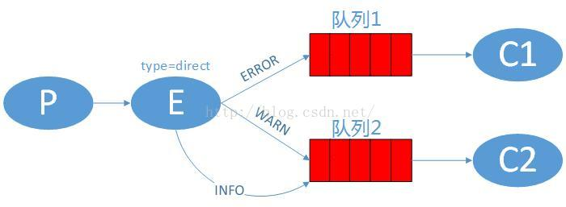
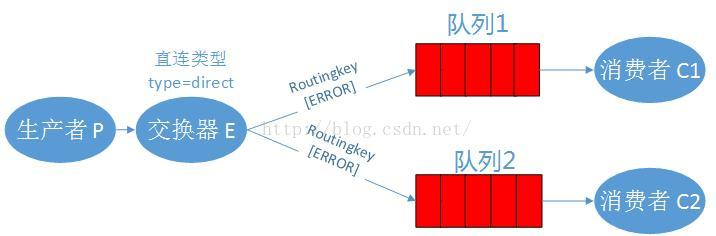
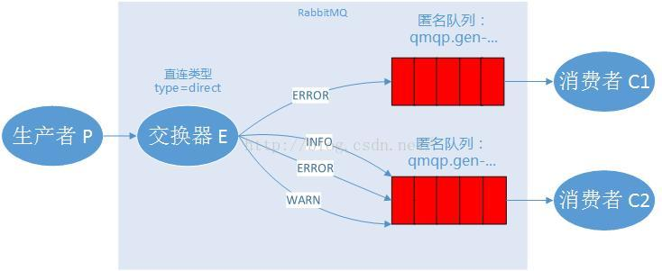

# 消息路由
  本章，我们将添加一个新功能，类似订阅消息的子集。例如：我们只接收日志文件中ERROR类型的日志。

##绑定关系
绑定可以使用routingkey这个参数，是为了避免所有的消息都使用同一个路由线索带来的麻烦。为了区分路由规则，我们创建创建一个唯一的路由线索。
```
channel.queueBind(queueName, EXCHANGE_NAME, "black");  
```
绑定关系中使用的路由关键字【routingkey】是否有效取决于交换器的类型。如果交换器是分发【fanout】类型，就会忽略路由关键字【routingkey】的作用。

###直连类型交换器
上一章的例子是通过分发【fanout】类型的交换器【logs】广播日志信息，现在我们将日志分debug、info、warn、error这几种基本的级别，  
实际在生产环境中，避免磁盘空间浪费，应用只会将error级别的日志打印出来。  
而分发【fanout】类型的交换器会将所有基本的日志都发送出来，如果我们想只接收某一级别的日志信息，就需要使用直连【direct】类型的交换器了,   
下面的图中，队列1通过ERROR这个routingkey绑定到E交换器，队列2通过WARN和INFO绑定到E交换器，E交换器的类型是直连【direct】的，  
如果生产者【P】发出ERROR的日志，只会有队列1会收到，  
如果生产者【P】发出INFO和WARN的日志，只有队列2会收到，  
如果生产者【P】发出DEBUG级别的日志，队列1和队列2都会忽略它。


###多重绑定
我们允许多个队列以相同的路由关键字绑定到同一个交换器中，可以看到，交换器虽然是直连类型，但是绑定后的效果却跟分发类型的交换器类似，相同的是队列1和队列2都会收到同一条来自交换器的消息。

他们的区别：分发模式下，队列1、队列2会收到所有级别（除ERROR级别以外）的消息，而直连模式下，他们仅仅只会收到ERROR关键字类型的消息。



##发送日志消息

我们还是用日志系统进行讲解，现在我们用日志的级别来作为路由关键字【routingkey】，这样，消费者端就可以按照他关心的日志级别进行接收，我们先看看如何发送日志：

先声明交换器

        channel.exchangeDeclare(EXCHANGE_NAME, "direct"); 
        
然后发送消息到交换器

    for (String routingKey : routingKeys) {
        String message = "Send the message level:" + routingKey;
        channel.basicPublish(EXCHANGE_NAME, routingKey, null, message.getBytes());
        System.out.println(" [x] Sent '" + routingKey + "':'" + message + "'");
    }

##订阅消息

我们先获取一个随机的队列名称，然后根据多个路由关键字【routingkey】将队列和交换器绑定起来：

        String queueName = channel.queueDeclare().getQueue();
        for (String routingKey : routingKeys) {
            channel.queueBind(queueName, EXCHANGE_NAME, routingKey);
            System.out.println("ReceiveLogsDirect1 exchange:" + EXCHANGE_NAME + ", queue:" + queueName + ", BindRoutingKey:" + routingKey);
        }

##流程图



#运行

先运行ReceiveLogsDirect1.java和ReceiveLogsDirect2.java  
运行RoutingSendDirect.java发送消息  

结果：我们看到，队列1收到了所有的消息，队列2只收到了error级别的消息。这与我们的预期一样。


 如果在windows7下，你需要先双击rabbitmq-server.bat，来启动RabbitMQ服务。  
 否则，运行我们的程序时，会提示【java.net.ConnectException: Connection refused: connect】

 先运行消费者服务器来关注【hello】这个队列的情况。  
C [*] Waiting for messages. To exit press CTRL+C  

然后再运行生产者端，发送消息到队列中：  
P [x] Sent 'Hello World!'  

再切换到消费者端的控制台，查看日志：  
C [*] Waiting for messages. To exit press CTRL+C  
C [x] Received 'Hello World!'  

#总结

从上面的日志，我们就算是对RabbitMQ 的消息流有了一个基本的了解，如果你想更进一步，请进入到第二章-Work Queues的教程