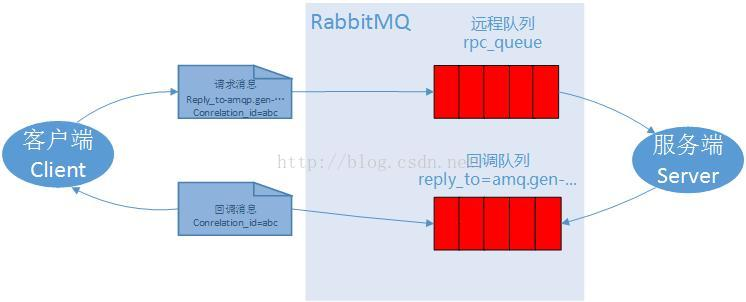

# 远程调用

 本教程中，我们将学习使用工作队列让多个消费者端来执行耗时的任务。比如我们需要通过远程服务器帮我们计算某个结果。这种模式通常被称之为远程方法调用或RPC.
 
 我们通过RabbitMQ搭建一个RPC系统，一个客户端和一个RPC服务器，客户端有一个斐波那契数列方面的问题需要解决（Fibonacci numbers），RPC服务器负责技术收到这个消息，然后计算结果，并且返回这个斐波那契数列。

##客户端接口
  
  我们需要创建一个简单的客户端类，通过调用客户端的call方法，来计算结果。

 远程方法调用的注意事项：
 
 RPC在软件开发中非常常见，也经常被批评。当一个程序员对代码不熟悉的时候，跟踪RPC的性能问题是出在本地还是远程服务器就非常麻烦，对于RPC的使用，有几点需要特别说明：
 
    使用远程调用时的本地函数最好独立出来
    保证代码组件之间的依赖关系清晰明了，并用日志记录不同的执行过程和时间
    发生客户端运行缓慢或者假死时，先确认RPC服务器是否还活着！
    尽量使用异步队列来处理RPC请求，尽量不要用同步阻塞的方式运行RPC请求  

##回调队列
在RabbitMQ的RPC中，客户端发送请求后，还需要得到一个响应结果，我们需要像下面这样，在发送请求时，带上一个回调队列：
```
replyQueueName = channel.queueDeclare().getQueue();

MQP.BasicProperties props = new AMQP.BasicProperties
                .Builder()
                .correlationId(corrId)
                .replyTo(replyQueueName)
                .build();

channel.basicPublish("", requestQueueName, props, message.getBytes("UTF-8"));
```

##消息属性

传输一条消息，AMQP协议预定义了14个属性，下面几个是使用比较频繁的几个属性：

deliveryMode：配置一个消息是否持久化。（2表示持久化）这个在第二章中有说明。
contentType ：用来描述编码的MIME类型。与html的MIME类型类似，例如，经常使用JSON编码是将此属性设置为一个很好的做法：application/json。
replyTo ： 回调队列的名称。
correlationId：RPC响应请求的相关编号。这个在下一节讲。

##关联编号  Correlation Id

如果一个客户端有很多的计算任务，按照上面的代码，我们会为每个任务创建一个请求，然后等待返回的结果，这种方法貌似很耗时，如果把所有的任务都放到同一个连接中，那么我们又没法分辨出返回的结果是那个任务的？  
为了解决这个问题，RabbitMQ提供了一个correlationid属性来解决这个问题。  
RabbitMQ为每个请求提供唯一的编号，然后在返回队列里如果看到了这个编号，就知道我们的任务处理完成了，如果收到的编号不认识，就可以安全的忽略。  
你可能会疑问，如果忽略了，那么想知道这个返回结果的客户端是不是就收不到这个结果了？这个基本上不会出现，  
但是，理论上也可能发生，例如一个RPC服务器，在发送确认消息前挂了，你收到的消息可能就是不完整的。  
这种情况，RabbitMQ会重新发送任务处理请求。这也是为什么客户端必须处理这些重复请求以及RPC启用幂次模式。

##RPC工作方式：



* 当客户端启动时，会创建一个匿名的回调队列
* 在RPC请求中，定义了两个属性：replyTo，表示回调队列的名称； correlationId，表示请求任务的唯一编号，用来区分不同请求的返回结果。
* 将请求发送到rpc_queue队列中
* RPC服务器等待rpc_queue队列的请求，如果有消息，就处理，它将计算结果发送到请求中的回调队列里。
* 客户端监听回调队列中的消息，如果有返回消息，它根据回调消息中的correlationid进行匹配计算结果。

#总结

