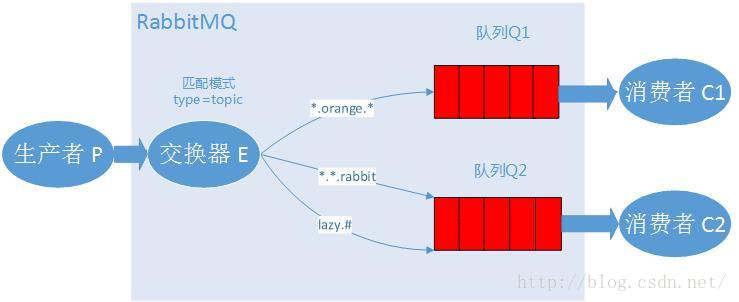

# Topic模式
  
  topic类型的交换器允许在RabbitMQ中使用模糊匹配来绑定自己感兴趣的信息。  
  在上一章，通过直连交换器，生产者发送不同路由关键字的日志，消费者端通过绑定自己感兴趣的路由关键字来接收消息，进行完善日志系统。  
  如果我想只接收生产者com.test.rabbitmq.topic包下的日志，其他包的忽略掉，之前的日志系统处理起来可能就非常麻烦，  
  还好，我们有匹配模式，现在我们将生产者发送过来的消息按照包名来命名，那么消费者端就可以在匹配模式下使用【#.topic.*】这个路由关键字来获得感兴趣的消息。

##匹配交换器

通过匹配交换器，我们可以配置更灵活的消息系统，你可以在匹配交换器模式下发送这样的路由关键字：  
“a.b.c”、“c.d”、“quick.orange.rabbit”  
不过一定要记住，路由关键字【routingKey】不能超过255个字节（bytes）  

匹配交换器的匹配符
    
    *（星号）表示一个单词
    #（井号）表示零个或者多个单词

##示例说明：
这一章的例子中，我们使用三个段式的路由关键字，有三个单词和两个点组成。第一个词是速度，第二个词是颜色，第三个是动物名称。

我们用三个关键字来绑定，Q1绑定关键字是【*.orange.*】,Q2绑定关键字是【*.*.rabbit】和【lazy.#】，然后分析会发生什么：

    Q1会收到所有orange这种颜色相关的消息
    Q2会收到所有rabbit这个动物相关的消息和所有速度lazy的动物的消息
分析：
     
    生产者发送“quick.orange.rabbit”的消息，两个队列都会收到
    生产者发送“lazy.orange.elephant”，两队列也都会收到。
    生产者发送"quick.orange.fox"，那么只有Q1会收到。
    生产者发送"lazy.brown.fox"，那么只会有Q2能收到。
    生产者发送"quick.brown.fox"，那么这条消息会被丢弃，谁也收不到。
    生产者发送"quick.orange.male.rabbit"，这个消息也会被丢弃，谁也收不到。
    生产者发送"lazy.orange.male.rabbit"，这个消息会被Q2的【lazy.#】规则匹配上，发送到Q2队列中。

##注意

交换器在匹配模式下：

如果消费者端的路由关键字只使用【#】来匹配消息，在匹配【topic】模式下，它会变成一个分发【fanout】模式，接收所有消息。

如果消费者端的路由关键字中没有【#】或者【*】，它就变成直连【direct】模式来工作。

